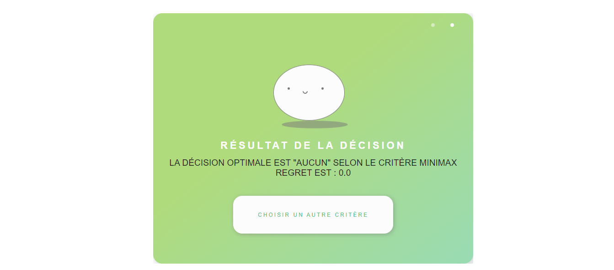

## Personal Portfolio

Welcome to my portfolio repository! Here, you can delve into my skills, projects, and professional journey. Discover noteworthy achievements and explore exciting collaboration opportunities. Additionally, this repository is exclusively reserved for confidential and personal projects, offering detailed descriptions and accompanying screenshots for reference. Thank you for visiting!

## Features

- **Visual Presentation:** A clean and modern design for a pleasant user experience.
- **Projects:** Explore my past and current projects with detailed descriptions.
- **Skills:** A comprehensive list of my technical and professional skills.
- **Contact:** Stay in touch with me using the provided contact information.

## Completed Projects

## Project1 -> Web Scraper and Product Recommendation

Engage with our web scraper project, extracting product information from various e-commerce sites in Tunisia, including Mytek, Tunisianet, and SBS Informatique. The extracted data is stored in a MySQL database, offering features such as data extraction, database storage, visualization, filtering, and prediction.

.png)
.png)
.png)
.png)
.png)
.png)

## Project2 -> eLearning Platform

Embark on a language-learning journey with our PHP-powered eLearning platform. Similar to Udemy, it offers a dynamic and certified learning experience for language enthusiasts. Enjoy a responsive design, customizable learning paths, certified instructors, and a secure, feature-rich environment. Start your language journey today, mastering new skills and earning recognized certifications. 

- Personalized learning with adaptive training programs.
- Comprehensive skills assessment and progress tracking.
- 3D model interaction for immersive language concept visualization.
- API integration using Django and Django REST for seamless frontend interaction.
- Intelligent chatbot powered by Flask, utilizing natural language processing (NLP).
- Chatbot functionalities include word meaning clarification, responding to user queries, and providing precise definitions.
- Security assessment with Nmap, Nikto, OWASP Zap, Burp Suite, DirBuster, and GoldenEye.
**Technologies:** Django, Python, Flask, React.js, Three.js, PostgreSQL.
**Feedback:**
Flight2Fluency, acclaimed with the highest rating in the 2023 promotion, boasts an advanced chatbot utilizing Flask, NLP, and 3D model integration. Learners benefit from interactive language assistance, precise word meaning explanations, and user-friendly query responses. The project's robust security assessment and technology stack, including Django, Python, React.js, Three.js, and PostgreSQL, have garnered positive acclaim for its overall excellence.
.png)
.png)
.jpg)

## Project3 -> Site Web Manager & CRM

Explore our comprehensive Project Site Web Manager & CRM, a PHP-based solution designed to streamline project management and customer relationship processes. This all-in-one platform encompasses unified project management, sales and client management, team collaboration, and customizable dashboards. With a user-friendly interface and scalability, it aims to enhance productivity and ensure a secure and reliable experience.

**Key Features:**
- Unified Project Management
- Sales Management
- Client Management
- Team Collaboration
- Customizable Dashboards
- Reports and Analytics
- User-Friendly Interface
- Scalable and Flexible
- Secure and Reliable
.png)
.png)

## Project5 -> E-Learning Platform for Language Enhancement and Test Preparation
This platform offers personalized learning experiences with adaptive training programs and comprehensive skills assessments. It features innovative tools for immersive language concept visualization and progress tracking.

.png)
.png)
.png)
.png)
.png)

## Project4 -> Multi-Purpose News and Magazine Script

Discover the versatility of our PHP-powered news and magazine script, providing a clean, responsive, and user-friendly design for creating and managing sophisticated news websites. With features such as multilingual support, RTL support, SEO optimization, and various layout options, this script ensures a seamless experience for administrators and visitors alike.

**Key Features:**
- Clean and Responsive Design
- Multilingual System
- RTL Support
- SEO Optimized
- Layout Options
- Author Management System
- RSS Aggregator System
- Ad Spaces
- Progressive Web App (PWA) Support
- AWS S3 Integration
- Structured Data
- Editable Pages
- Contact Page
- Reading List
- Featured Posts, News Ticker, and Emoji Reactions
- Post Formats
- Scheduled and Pending Posts
- Newsletter and Subscriber Management
- Lazy Image Loading and Dynamic Tag System
- Voting Polls and Social Integration
- Widgets and Page View Counts
- Comment System
- Roles & Permissions
- Membership System
- Advanced Settings and Visual Customization
- Security and Authentication

.png)
.png)
.png)
.png)

## Personal portfolio
This is my personal portfolio! I’m Wissal, a dedicated freelancer with a Master's degree in Big Data and Artificial Intelligence from Université Paris Dauphine. I specialize in data science, machine learning, web development, and more. My journey in the tech world is driven by a passion for creating innovative solutions that enhance learning and streamline processes. 
https://wissalbenothmen.netlify.app

.png)
.png)
.png)
.png)

## Project5 -> Research on Student Learning Preferences
In the context of my Master's in Big Data and Artificial Intelligence, I conducted an in-depth study on student learning preferences, including PCA, CA, MCA, and classification methods like K-means and Ward. Using these advanced analytical methods, I explored global responses to a questionnaire.
Caractéristiques clés :

Analyse multidimensionnelle des styles d'apprentissage et des préférences pédagogiques (ACP, AFC, ACM).
Utilisation de techniques de classification pour une exploration approfondie.
Exploration visuelle des préférences dans les domaines d'études et les loisirs.
Investigation des liens entre facteurs psychologiques et types d'intelligence.

Keywords:
Learning preferences, PCA, CA, MCA, Classification, Educational strategies.
.png)
.png)
.png)
.png)

## Project6 -> Model Analysis and Selection Project for Prostate-Specific Antigen (lpsa) Prediction

This project aims to develop accurate and robust predictive models for predicting the level of prostate-specific antigen (lpsa) from various clinical variables. PSA is a crucial biomarker used to assess the risk of prostate cancer. The data used are from the study by Stamey et al. (1989) and include variables such as the log of cancer volume, log of prostate weight, age, and other relevant clinical features. The project begins with a data exploration phase, including visualization of distributions, checking for missing values, and normalization of variables to ensure data quality before modeling. Several techniques are then applied, including classical linear models, model selection methods, regularization techniques (Ridge, Lasso, Elastic Net), as well as partial least squares (PLS) and principal component regression (PCR). Each method is evaluated with different configurations to ensure model optimality. Cross-validation techniques are used to select the best hyperparameters and evaluate the predictive performances of each model. The goal is to compare these approaches to identify the most effective and applicable method in a clinical context for predicting lpsa level.This project aims to develop accurate and robust predictive models for predicting the level of prostate-specific antigen (lpsa) from various clinical variables. PSA is a crucial biomarker used to assess the risk of prostate cancer. The data used are from the study by Stamey et al. (1989) and include variables such as the log of cancer volume, log of prostate weight, age, and other relevant clinical features. The project begins with a data exploration phase, including visualization of distributions, checking for missing values, and normalization of variables to ensure data quality before modeling. Several techniques are then applied, including classical linear models, model selection methods, regularization techniques (Ridge, Lasso, Elastic Net), as well as partial least squares (PLS) and principal component regression (PCR). Each method is evaluated with different configurations to ensure model optimality. Cross-validation techniques are used to select the best hyperparameters and evaluate the predictive performances of each model. The goal is to compare these approaches to identify the most effective and applicable method in a clinical context for predicting lpsa level.
Skills: Machine Learning

.png)
.png)
.png)
.png)

## Project7 -> Model Analysis and Selection Project for Prostate-Specific Antigen (lpsa) Prediction

This study compares various algorithms for solving the N-Queens problem, a classic problem in artificial intelligence. The N-Queens problem involves placing N queens on an N × N chessboard such that no two queens threaten each other, according to the rules of chess. The problem is formalized as a Constraint Satisfaction Problem (CSP).

Objectives:

Formalize the N-Queens problem as a CSP.
Implement and compare the AC3 algorithm, depth-first search with backtracking, and Forward checking algorithm.
Analyze the results and draw conclusions.This study compares various algorithms for solving the N-Queens problem, a classic problem in artificial intelligence. The N-Queens problem involves placing N queens on an N × N chessboard such that no two queens threaten each other, according to the rules of chess. The problem is formalized as a Constraint Satisfaction Problem (CSP). Objectives: Formalize the N-Queens problem as a CSP. Implement and compare the AC3 algorithm, depth-first search with backtracking, and Forward checking algorithm. Analyze the results and draw conclusions.
Skills: Artificial Intelligence (AI) · Algorithms

.png)
.png)
.png)
.png)
.png)

## Project8 -> Q-Learning Algorithm Implementation for Maze Solving

This project, part of the Big Data and Artificial Intelligence Master's program, focuses on implementing the Q-learning algorithm to solve maze problems. The objective is to train an agent to find the shortest path from a starting point to an exit point in a maze, while avoiding walls. The project involves creating the maze structure, defining states, actions, rewards, and algorithm parameters, training the agent using Q-learning, and validating its ability to find optimal paths in various maze configurations.This project, part of the Big Data and Artificial Intelligence Master's program, focuses on implementing the Q-learning algorithm to solve maze problems. The objective is to train an agent to find the shortest path from a starting point to an exit point in a maze, while avoiding walls. The project involves creating the maze structure, defining states, actions, rewards, and algorithm parameters, training the agent using Q-learning, and validating its ability to find optimal paths in various maze configurations.
Skills: Reinforcement Learning

.png)
.png)
.png)
.png)

## Project9 -> Top 5% in Kaggle Competition - House Prices Prediction

Participated in a Kaggle competition for predicting house prices in Ames, Iowa, using 79 explanatory variables. Ranked 240th out of 4841 participants, in the top 5% of competitors. Implemented data preprocessing techniques including handling missing values and outliers, featuring engineering, and used various advanced regression models. Additionally, applied stacking and blending techniques with models such as ElasticNet, Lasso, Ridge, SVR, GradientBoosting, XGBoost, and LightGBM for predictions.

.png)
.png)
.png)

## Project10 -> Decision-Making Tool under Uncertainty: A Python Flask Web Application

This project, developed during my university studies, involved creating a web application using Python Flask to aid in decision-making under uncertainty. The tool allows users to input decision criteria and weights for each criterion. It then computes the decision outcome using methods such as maximin, maximax, Laplace, Bernoulli, Hurwicz, and minimax regret. This enables users to compare outcomes and make informed decisions.This project, developed during my university studies, involved creating a web application using Python Flask to aid in decision-making under uncertainty. The tool allows users to input decision criteria and weights for each criterion. It then computes the decision outcome using methods such as maximin, maximax, Laplace, Bernoulli, Hurwicz, and minimax regret. This enables users to compare outcomes and make informed decisions.
Skills: Decision-Making 

 system for hospitals, integrating machine learning models to monitor patient status and predict the probability of nosocomial infection risks in real time.Participated in a hackathon to develop a Human Resources Management (HRM) system for hospitals, integrating machine learning models to monitor patient status and predict the probability of nosocomial infection risks in real time.
Skills: Machine Learning · Laravel · Teamwork · Team Leadership

.png.jpg)
.png)
.png)
.png)
.png)
.png)

## Project12 -> 3rd Prize Winners - Airbnb and 2024 Olympic Games Hackathon

Our team was awarded the 3rd prize at a hackathon focused on Airbnb and the 2024 Olympic Games. The challenge for participating teams was to propose improvements to the user experience on Airbnb, integrating Geographic Analysis, Natural Language Processing (NLP), and Host Profile Study. Our approach included understanding travelers' preferences based on location, past habits, and activities they enjoyed in a specific region, proposing experiences tailored to user interests while considering factors such as weather, sports events, and tourist activities developed around them. Additionally, we suggested implementing a search function based on Natural Language Processing (NLP) to allow users to find accommodations using more natural and conversational queries. We also analyzed listing descriptions and user reviews to understand the most important features and amenities for each traveler, refining search results accordingly. We extracted the requirements requested by the tenants and conducted a sentimental analysis to categorize them with their requirements

.png)
.png)
.png)

Thank you for visiting the "MyProjects" section of my portfolio repository! If you have any questions or if there's a project you'd like to explore further, feel free to reach out. Your interest is greatly appreciated!
